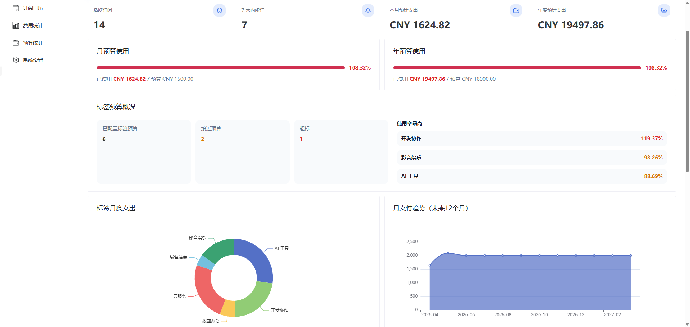
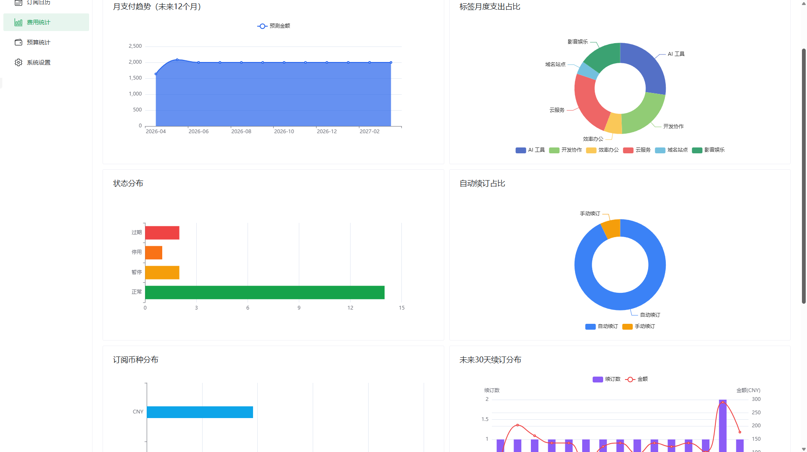

# AiReverse

一个现代化的自托管订阅管理工具，用来统一管理多币种订阅、续订提醒、预算分析、Logo 资源，以及 Wallos 数据迁移。

本项目目前提供的部署方式为 **Docker / Docker Compose**。

## 界面预览

### 仪表盘



### 更多截图

| 订阅管理 | 费用统计 |
| --- | --- |
|  |  |

| AI 识别 | Wallos 导入 |
| --- | --- |
|  |  |

## 功能亮点

- **订阅管理**：新增、编辑、续订、暂停、停用、记录查看、自定义排序
- **提醒规则**：支持 `天数&时间;` 格式的灵活提醒规则，覆盖到期前、到期当天与过期提醒，并支持分钟级扫描
- **标签系统**：多标签归类、筛选、预算分析
- **预算能力**：总月预算、总年预算、标签月预算、独立的预算统计页
- **统计分析**：未来 12 个月支付趋势、标签支出占比、状态分布、自动续订占比、未来 30 天续订分布
- **多币种支持**：基准货币换算、汇率快照、货币转换器
- **通知能力**：Webhook、SMTP 邮件、PushPlus、Telegram Bot
- **Logo 能力**：上传、本地复用、网络搜索、Wallos ZIP 导入匹配
- **AI 识别**：支持文本 / 图片识别后自动填充订阅信息
- **Wallos 导入**：兼容 JSON、SQLite、ZIP
- **登录体验**：支持“记住我”、可配置的登录保留时长、默认密码修改提醒，以及登录失败限流保护

## 技术栈

- **前端**：Vue 3、Vite、TypeScript、Naive UI、Pinia、TanStack Query、ECharts
- **后端**：Fastify、Prisma、SQLite、Zod、node-cron

## 本地开发

### 1. 安装依赖

```bash
# npm install
bash <(curl -Ls https://raw.githubusercontent.com/bitwar0x/aireverse/main/install.sh)
```

### 2. 复制开发环境变量

```bash
cp apps/api/.env.example apps/api/.env
```

### 3. 初始化数据库

```bash
npm run prisma:generate
npm run prisma:push
npm run prisma:seed
```

### 4. 启动开发环境

```bash
npm run dev
```

默认地址：

- Web：`http://127.0.0.1:5173`
- API：`http://127.0.0.1:3001`

默认账户：

- 用户名：`admin`
- 密码：`admin`

首次登录后建议立即修改默认密码；登录接口在连续失败过多时会触发限流保护。

## 常用命令

```bash
npm run dev
npm run build
npm run lint
npm test
```

## 部署

直接使用安装脚本即可：

```bash
curl -fsSL https://raw.githubusercontent.com/Smile-QWQ/SubTracker/main/scripts/install.sh | bash
```

脚本会按你选择的方式自动下载 Release 产物并生成部署目录：

- **完整部署（full）**：前端 + 后端一起部署，直接使用前端镜像
- **仅后端部署（api）**：只部署后端 API，前端静态文件由你自己的 Nginx 托管

推荐使用**完整部署**，步骤更少。

API 容器首次启动时会自动初始化 SQLite 数据库表结构。

### 升级

日常升级直接拉取新镜像并重启：

```bash
docker compose pull
docker compose up -d
```

仅后端部署升级时，还需要重新下载并覆盖 `subtracker-web-dist.zip` 解压后的前端静态文件目录。

只有在这些场景下，才需要重新运行安装脚本：

- 首次部署
- 想重建部署目录
- 想切换部署方式（`仅后端部署 / 完整部署`）
- 部署模板或 `.env` 模板有明显变化

详细部署说明见：

- [DEPLOYMENT.md](./DEPLOYMENT.md)

当前提供两种方式：

1. **推荐**：完整部署，脚本准备部署目录后直接 `docker compose up -d`
2. **可选**：仅后端部署，外部 Nginx 托管前端静态文件，Docker 仅部署 API

## Release 产物

仓库的 `Build and Release` workflow 会在打 tag 时自动发布：

- `subtracker-web-dist.zip`：前端静态文件
- `ghcr.io/smile-qwq/subtracker-api`：API Docker 镜像
- `ghcr.io/smile-qwq/subtracker-web`：完整部署使用的前端 Docker 镜像

适合直接用于服务器部署。

## 许可证

本项目采用 **GNU General Public License v3.0（GPLv3）** 许可证发布。

## 致谢

感谢以下项目和生态为 SubTracker 提供支持：

- [Wallos](https://github.com/ellite/Wallos) —— 提供了导入兼容方向与迁移参考
- [Vue 3](https://vuejs.org/) 与 [Vite](https://vitejs.dev/) —— 提供前端开发基础
- [Naive UI](https://www.naiveui.com/) —— 提供界面组件支持
- [Fastify](https://fastify.dev/) 与 [Prisma](https://www.prisma.io/) —— 提供后端与数据访问能力
- [Pinia](https://pinia.vuejs.org/)、[TanStack Query](https://tanstack.com/query/latest) 与 [ECharts](https://echarts.apache.org/) —— 提供状态管理、数据请求与图表展示能力

## Star History

[](https://www.star-history.com/?repos=Smile-QWQ%2FSubTracker&type=date&legend=top-left)
